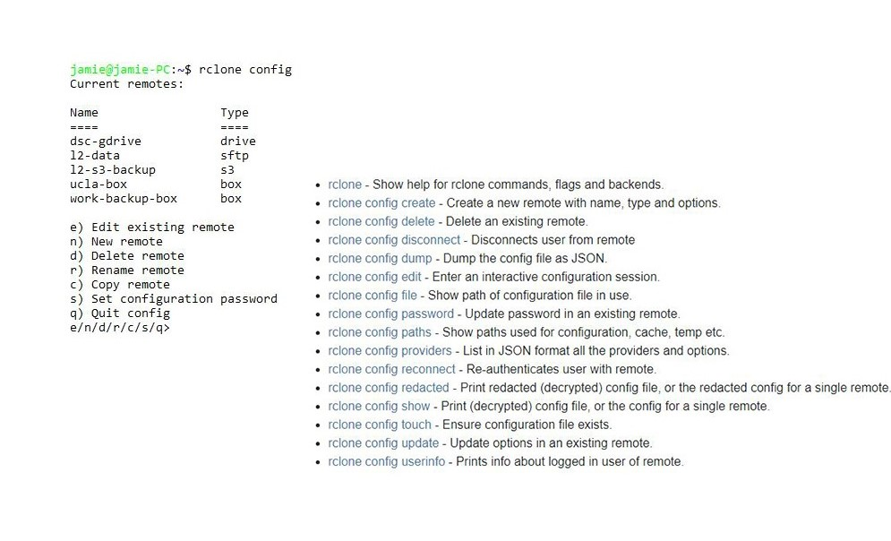

```{r setup, include=FALSE}
knitr::opts_chunk$set(echo = TRUE)
```

## Configuring rclone: config command to enter interactive setup

Enter an interactive configuration session where you can setup new remotes and manage existing ones. You may also set or remove a password to protect your configuration.

##### syntax:  rclone config [flags]

```
rclone config 

```



## Reference

[https://rclone.org/commands/rclone_config/](https://rclone.org/commands/rclone_config/)
