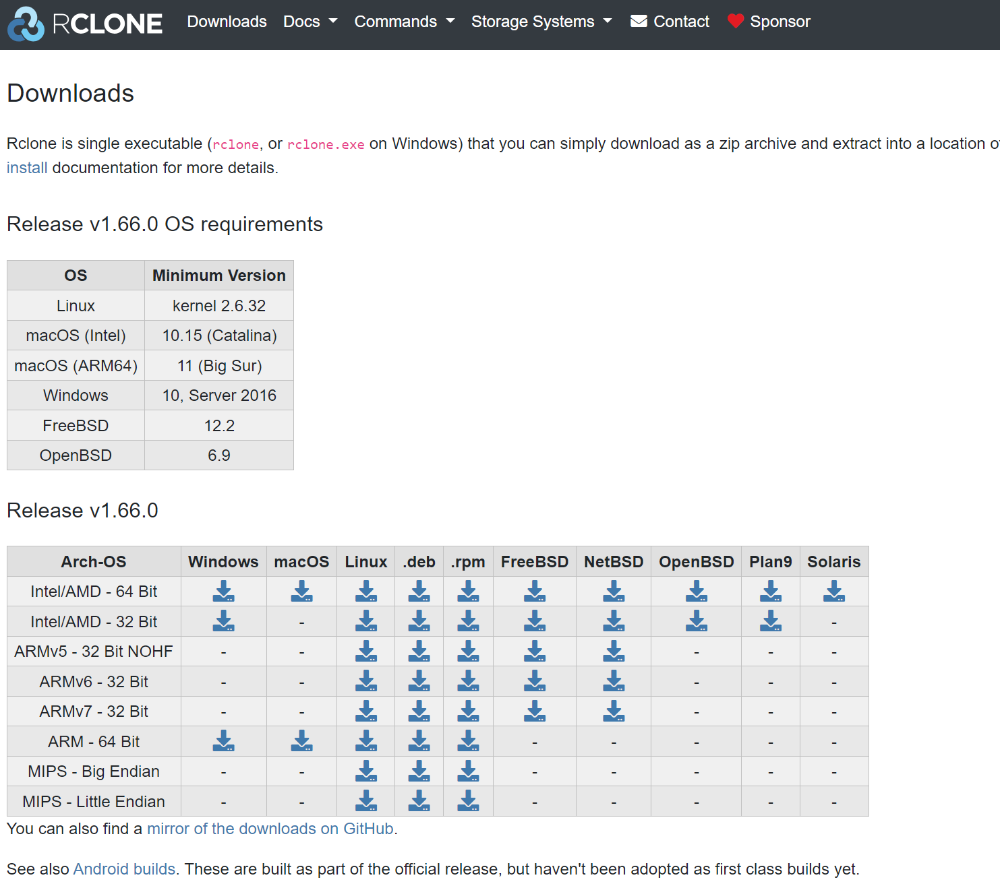

Rclone is a cross-platform application. It runs on Linux, Windows and MacOS. The installation files for different systems can be found on the Rclone download page.

## Software Setup

::: discussion
### Details

[Rclone downloads for various OS](https://rclone.org/downloads/)

:::

